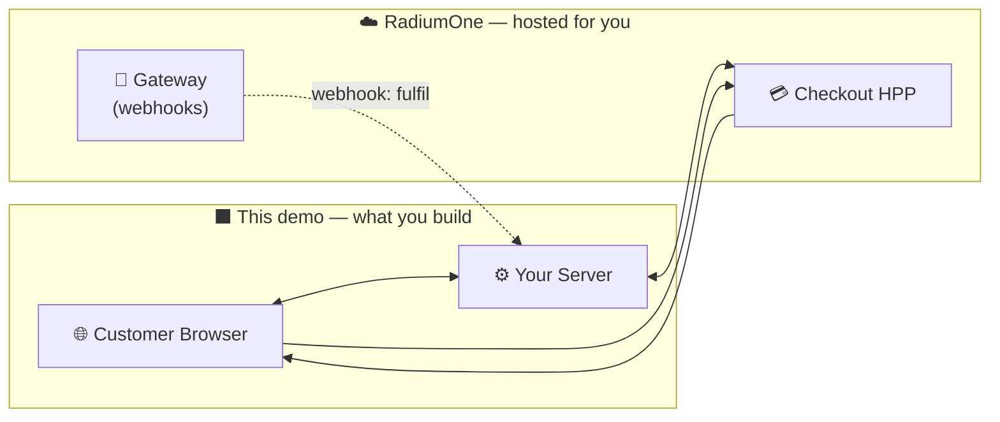
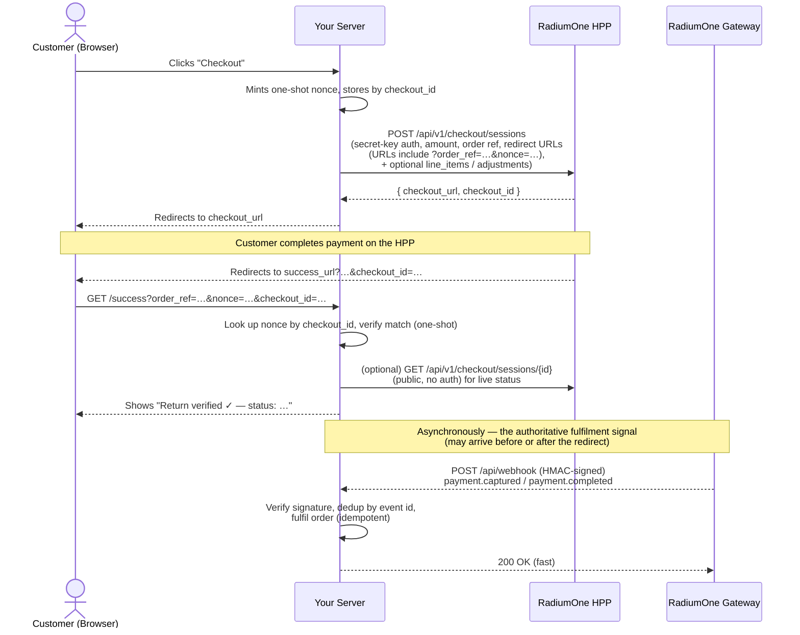

# RadiumOne Checkout — Demo Shopping Cart & Integration Examples

[](https://github.com/cubepay/radiumone-checkout-demo/actions/workflows/ci.yml?query=branch%3Amain)
[](./LICENSE)
[](https://nodejs.org)

Working code examples that show you exactly what your shopping cart needs to do to integrate with the **RadiumOne Checkout Hosted Payment Page (HPP)**.

> **Goal:** clone, add your sandbox credentials, and see a real HPP redirect working in under 5 minutes.

---

## What this demo represents

The HPP checkout flow involves three parties. **This demo is the merchant side** — the server and frontend that *your* application needs to implement.



The demo intentionally uses a **skeleton wireframe cart** (greyscale placeholders, no real products). That's by design — the cart UI is not the point. The integration code is.

---

## How the checkout flow works



### Key points for your implementation

- **Session creation is server-side only.** Your secret key never touches the browser.
- **The HPP handles the payment UI.** You redirect the customer there; you don't build a card form.
- **Verify the return is yours.** Bake a one-shot nonce into the `success_url` / `cancel_url` you pass to the HPP, then verify it on return against your own store (the demo uses an in-memory `Map`; you'd use your order or session DB). The HPP appends `?checkout_id=…` on return; the demo's self-minted nonce needs no shared secret. (The HPP also supports an optional `state` field and `sig` HMAC for HPP-attested returns — see the [integration guide](./docs/integration-guide.md#step-3--verify-the-return-server-side).)
- **Read the session status for display (optional).** `GET /api/v1/checkout/sessions/{checkout_id}` is public (no auth) and useful for rendering live state on your return page.
- **Fulfil orders from the webhook, not the redirect.** The redirect can be missed (browser closed, network drop). Use the RadiumOne **Gateway** webhook for reliable order fulfilment — both examples include a reference receiver at `POST /api/webhook`. See the [webhook guide](./docs/webhook-guide.md).

---

## Examples

| Example | Stack | Best for |
|---|---|---|
| [`examples/html-vanilla/`](./examples/html-vanilla/) | Plain HTML + Node.js stdlib | Quickest way to see it working. Zero npm install needed for mock mode. |
| [`examples/react-nextjs/`](./examples/react-nextjs/) | Next.js 15, TypeScript | Realistic full-stack pattern — session creation in a route handler, signature verification in a server component. |

Both examples implement exactly the same four steps: create session → redirect → verify return → show result.

---

## Quickstart

```bash
git clone https://github.com/cubepay/radiumone-checkout-demo.git
cd radiumone-checkout-demo
```

**No credentials? Try mock mode first** (no `.env`, no install):
```bash
cd examples/html-vanilla
node server.mjs
# Open http://localhost:3000 — click Checkout to see the request that would be sent
```
> A local server is required even for mock mode — the page loads ES modules and a shared fixture that browsers block over `file://`.

**Have sandbox credentials? Run against the real API:**
```bash
cd examples/html-vanilla
cp .env.example .env
# Fill in your r1sk_test_* secret key (the sandbox host is already set)
node --env-file=.env server.mjs
# Open http://localhost:3000
```

See [docs/getting-started.md](./docs/getting-started.md) for the full walkthrough including the Next.js example.

---

## Documentation

Start at the [**docs hub**](./docs/README.md), or jump straight in:

- [docs/integration-guide.md](./docs/integration-guide.md) — the full integration: the four steps, request/response fields, amount format, error codes, idempotency, test cards, go-live checklist
- [docs/webhook-guide.md](./docs/webhook-guide.md) — sample approach for handling Gateway webhooks: reference receiver, signature verify, idempotency/ordering, local testing
- [docs/architecture.md](./docs/architecture.md) — the three parties, demo components, and end-to-end data flow
- [docs/getting-started.md](./docs/getting-started.md) — setup walkthrough for both examples
- [docs/env-config.md](./docs/env-config.md) — what each environment variable does
- [docs/troubleshooting.md](./docs/troubleshooting.md) — fixes for common problems

> Webhook delivery is handled by the RadiumOne **Gateway**. Both examples include a reference receiver at `POST /api/webhook` (signature verification + idempotent, out-of-order-safe handling) — see [docs/integration-guide.md → Step 4](./docs/integration-guide.md#step-4--fulfil-from-the-gateway-webhook). Contact RadiumOne support to register your endpoint and get a signing secret.
