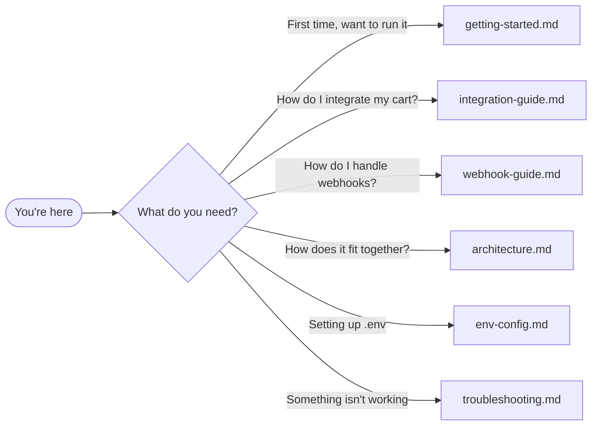

# Documentation

> Last verified: 2026-06-24

These docs cover **how to integrate, run, and understand this demo**. Start at the
project [README](../README.md), then dive in here.

---

## Where to start

---

## Docs in this folder

| Doc | What it covers |
|---|---|
| [getting-started.md](./getting-started.md) | Step-by-step walkthrough — prerequisites, credentials, running both examples |
| [integration-guide.md](./integration-guide.md) | The full integration: the four steps, request/response fields, amount format, errors, idempotency, test cards, go-live checklist |
| [webhook-guide.md](./webhook-guide.md) | Sample approach for handling Gateway webhooks: the reference receiver, signature verify, idempotency/ordering, local testing, production hardening |
| [architecture.md](./architecture.md) | The three parties, demo components, end-to-end data flow, redirect-integrity layers |
| [env-config.md](./env-config.md) | Every environment variable explained: what it's for, where to get it, whether to keep it secret |
| [troubleshooting.md](./troubleshooting.md) | Fixes for the most common failures when running the demos |

> Using an AI coding assistant? [AGENTS.md](../AGENTS.md) frames the same
> integration model as context for tools like Claude Code, Cursor, and Copilot.
