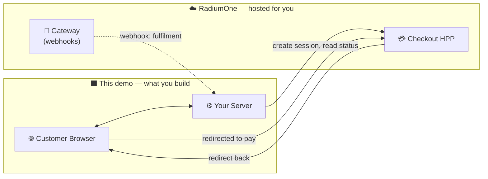
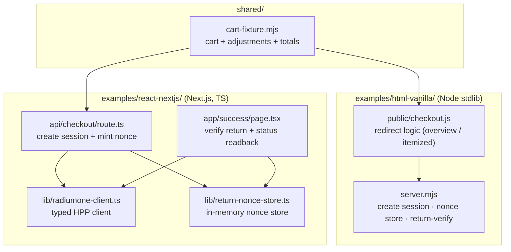
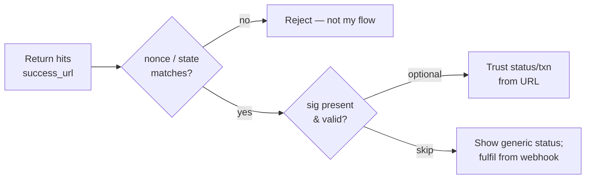

# Architecture & Data Flow

> Last verified: 2026-06-24

How the pieces fit together when integrating the **RadiumOne Checkout HPP**, and
what this demo does (and deliberately doesn't do). For the step-by-step field
reference, see [integration-guide.md](./integration-guide.md).

---

## Three parties

A checkout involves three actors. **This demo is the merchant side** — the server
and frontend *your* application provides.



| Party | Responsibility | Who builds it |
|---|---|---|
| Customer browser | Renders your cart; gets redirected to the HPP to pay | You |
| Your server | Creates sessions (secret key), verifies returns, fulfils on webhook | You |
| RadiumOne HPP | Hosts the payment page, processes the card | RadiumOne |
| RadiumOne Gateway | Emits authoritative `payment.*` / `refund.*` webhooks | RadiumOne |

The customer's card details only ever touch the RadiumOne-hosted page. Your
server never sees them.

---

## Components in this demo

The repo ships two interchangeable implementations of the **same four steps**,
plus one shared cart fixture so both stay consistent.



| Concern | html-vanilla | react-nextjs |
|---|---|---|
| Session create | `server.mjs` → `handleCheckoutPost()` | `api/checkout/route.ts` + `lib/radiumone-client.ts` |
| Redirect | `public/checkout.js` | `app/checkout-buttons.tsx` |
| Return verify | `server.mjs` → `handleReturnVerify()` | `app/success/page.tsx` + `lib/return-nonce-store.ts` |
| Cart data | `shared/cart/cart-fixture.mjs` (served static) | same fixture, imported |

---

## End-to-end data flow

```mermaid
sequenceDiagram
    actor C as Customer (Browser)
    participant M as Your Server
    participant HPP as RadiumOne HPP
    participant GW as RadiumOne Gateway

    C->>M: Click "Checkout"
    M->>M: Recompute amount from cart; mint one-shot nonce
    M->>HPP: POST /api/v1/checkout/sessions<br/>(X-Api-Key, amount, order_reference,<br/>success_url+cancel_url with nonce baked in)
    HPP-->>M: { checkout_id, checkout_url, status: pending }
    M->>M: Store { checkout_id → nonce }
    M-->>C: Redirect to checkout_url

    Note over C,HPP: Customer pays on the hosted page

    HPP->>GW: Payment outcome
    GW-->>M: Webhook payment.completed (authoritative) ⇒ fulfil order
    HPP-->>C: Redirect to success_url?…&checkout_id=…
    C->>M: GET /success?order_ref=…&nonce=…&checkout_id=…
    M->>M: Look up + consume nonce (one-shot)
    M->>HPP: (optional) GET /sessions/{checkout_id} for live status
    M-->>C: Show "Return verified ✓ — status: …"
```

Two independent signals come back after payment:

- **Redirect** (to the customer) — fast, but unreliable (browser can close). Use
  it only to show a status page.
- **Gateway webhook** (to your server) — authoritative. Fulfil orders from this.

---

## Redirect integrity — three composable layers

`success_url` / `cancel_url` are *your* routes, so you decide how strictly to
verify a return. Combine any of these:



| Layer | Proves | Used by demo? |
|---|---|---|
| **nonce / `state`** | "This return belongs to a flow I started" | ✅ Yes (self-minted nonce) |
| **`sig`** (HMAC, opt-in via `redirect_secret`) | "This return is HPP-attested for my account" | ➖ Optional, not in demo |
| **Gateway webhook** | Authoritative fulfilment | ✅ Yes (reference receiver at `/api/webhook`) |

Details and code in [integration-guide.md → Step 3](./integration-guide.md#step-3--verify-the-return-server-side).

---

## In scope vs out of scope

| In this demo | Out of scope (and why) |
|---|---|
| Server-side session creation | **Card form / payment UI** — hosted by RadiumOne |
| Redirect to the HPP | **Embedded (iframe) mode** — demo is redirect-only |
| Nonce-based return verification | **Persistent storage** — demo uses in-memory `Map`s; use your DB |
| Webhook receiver (verify + idempotent fulfil) | **Webhook endpoint registration** — done by CubePay support; no self-service portal yet |
| Optional live status readback | **Real product catalog / pricing** — cart is editable client-side; price server-side by SKU in production |
| Editable demo cart (price / qty / discount toggle) | **Cart persistence & auth** — edits reset on reload |

The cart UI is an intentionally skeletal wireframe — the integration code is the
point, not the storefront design.

---

## Where to next

- [integration-guide.md](./integration-guide.md) — the four steps, field by field
- [getting-started.md](./getting-started.md) — run it locally
- [env-config.md](./env-config.md) — environment variables
- [../AGENTS.md](../AGENTS.md) — the same model, framed for AI coding tools
