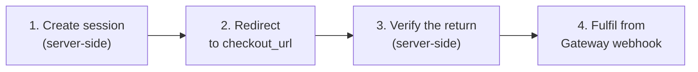
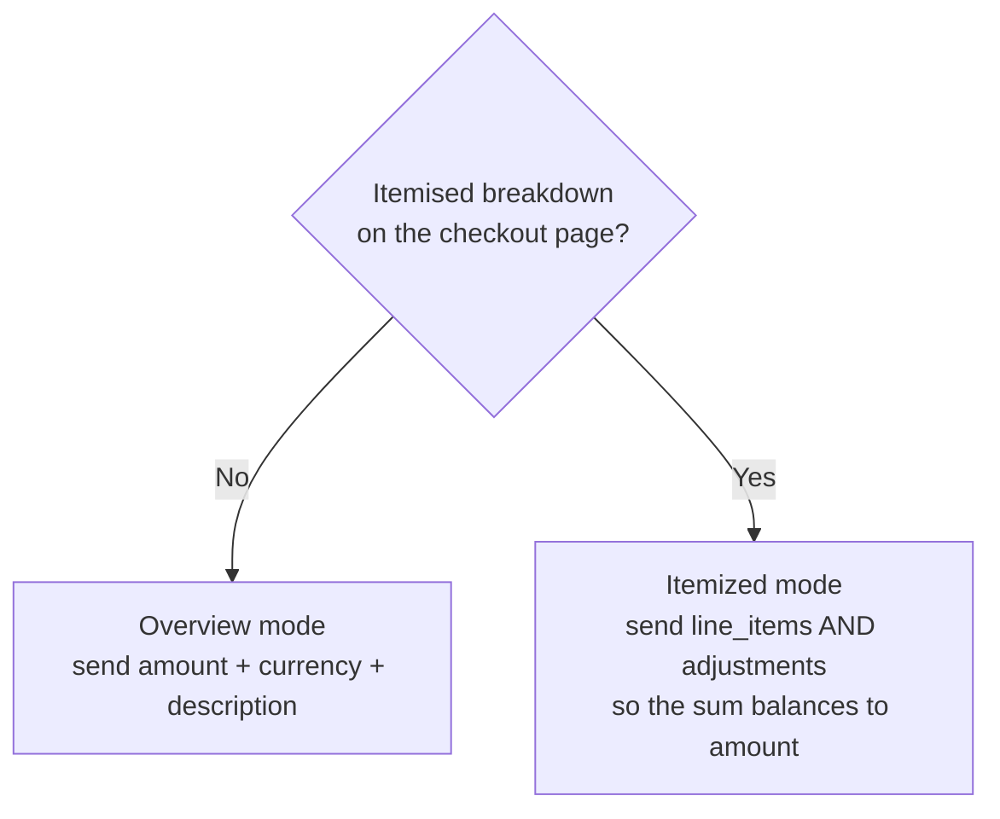
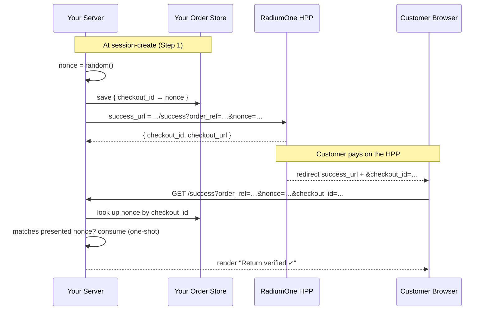
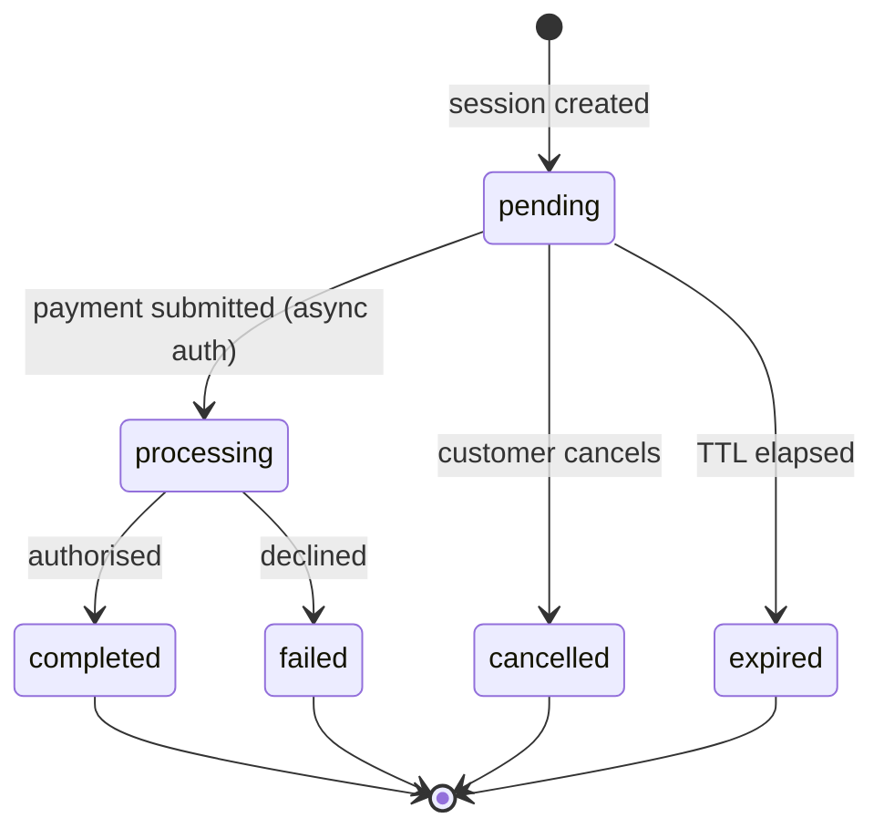

# Integration Guide

> Last verified: 2026-06-24

This is the practical, end-to-end guide to wiring your shopping cart into the
**RadiumOne Checkout Hosted Payment Page (HPP)**. It mirrors exactly what the two
examples in this repo do — read it alongside the source and you'll have a working
integration.

You implement the **merchant side**. RadiumOne hosts the payment page; you never
build a card form. There are four touchpoints:



| Step | Where it runs | Demo reference |
|---|---|---|
| 1. Create session | Your server | `examples/html-vanilla/server.mjs` → `handleCheckoutPost()` · `examples/react-nextjs/src/app/api/checkout/route.ts` |
| 2. Redirect | Browser | `examples/html-vanilla/public/checkout.js` · `examples/react-nextjs/src/app/checkout-buttons.tsx` |
| 3. Verify return | Your server | `server.mjs` → `handleReturnVerify()` · `src/app/success/page.tsx` |
| 4. Fulfil | Your server (webhook) | `server.mjs` → `handleWebhook()` · `src/app/api/webhook/route.ts` (see [Step 4](#step-4--fulfil-from-the-gateway-webhook)) |

---

## Prerequisites

| Need | Value |
|---|---|
| Sandbox API host | `https://checkout-sandbox.radiumone.io` |
| Production API host | Ask your RadiumOne contact |
| Secret key | `r1sk_test_*` (sandbox) / `r1sk_prod_*` (production) — from the merchant dashboard, **server-side only** |

The demo reads three environment variables. Full descriptions in
[env-config.md](./env-config.md):

```
RADIUMONE_BASE_URL      https://checkout-sandbox.radiumone.io
RADIUMONE_SECRET_KEY    r1sk_test_…   (never ship to the browser)
MERCHANT_BASE_URL       https://yourstore.com  (http://localhost:3000 for local dev)
```

---

## Amount format (read this first)

All monetary fields (`amount`, `unit_amount`) are **integers in the smallest
currency subunit**. Decimals are rejected (`49.99` → `400 validation:invalid_input`).

| Currency group | Subunit | Send | Means |
|---|---|---|---|
| SGD, USD, EUR, GBP, AUD, MYR, THB, PHP | cents (×100) | `4999` | 49.99 |
| JPY, KRW, VND, IDR | whole units (×1) | `5000` | 5,000 |
| BHD, KWD, OMR, JOD | mils (×1000) | `49990` | 49.990 |

The demo cart uses SGD: a final `amount` of `7652` means **SGD 76.52**.

---

## Step 1 — Create a checkout session (server-side)

Your server POSTs to the HPP and gets back a `checkout_url`. **Never call this
from the browser** — your secret key must stay server-side.

```
POST {RADIUMONE_BASE_URL}/api/v1/checkout/sessions
Content-Type: application/json
X-Api-Key: r1sk_test_…
```

> Authentication is the `X-Api-Key` header, **not** `Authorization: Bearer`.
> Sending a publishable key (`r1pk_*`) here is rejected.

### Request fields

| Field | Type | Required | Notes |
|---|---|---|---|
| `amount` | integer | Yes | Final charge, smallest subunit. See [Amount format](#amount-format-read-this-first). |
| `currency` | string | Yes | ISO 4217 (e.g. `SGD`). Order-level only — line items have no per-item currency. |
| `order_reference` | string | Yes | Your unique order ID. Also the **idempotency key** — see [Idempotency](#idempotency). Generate it server-side. |
| `success_url` | string | Yes | HTTPS URL to return to on success. Build it **server-side** from your own domain. |
| `cancel_url` | string | Yes | HTTPS URL to return to on cancel. |
| `description` | string | No | Shown on the checkout page. The demo always sends one. |
| `line_items` | array | No | Itemised lines — see below. |
| `adjustments` | array | No | Order-level discounts/taxes/fees — see below. |
| `metadata` | object | No | Your key-value pairs for reconciliation. |
| `customer.email` / `customer.name` | string | No | Pre-fill the checkout form. |
| `locale` | string | No | BCP-47 tag (e.g. `en`). |
| `ttl_minutes` | integer | No | Session lifetime, 5–60. Default 30. |

#### Line items

| Field | Type | Required |
|---|---|---|
| `name` | string | Yes |
| `quantity` | integer (≥1) | Yes |
| `unit_amount` | integer (smallest subunit) | Yes |
| `description` | string | No |

#### Adjustments (order-level)

| Field | Type | Notes |
|---|---|---|
| `kind` | string | One of `discount`, `tax`, `shipping`, `fee`. |
| `label` | string | Display label (e.g. `WELCOME10`, `GST 9%`). |
| `amount` | integer | `discount` must be **≤ 0**; `tax`/`shipping`/`fee` must be **≥ 0**. |

### The balancing rule (critical)

The HPP enforces:

```
sum(line_items[i].quantity × unit_amount) + sum(adjustments[j].amount) === amount
```

A mismatch is rejected with `400 validation:line_items_mismatch`. This couples
`line_items` and `adjustments` — **never send `adjustments` without
`line_items`** (the HPP would treat line items as 0 and reject). That's why the
demo shows two distinct patterns:



The demo cart (from `shared/cart/cart-fixture.mjs`):

| Part | Value (cents) |
|---|---|
| Widget Pro ×1 | 4900 |
| Add-on ×2 | 2400 |
| Setup fee ×1 | 500 |
| **Line items subtotal** | **7800** |
| Discount `WELCOME10` | −780 |
| Tax `GST 9%` | +632 |
| **`amount` (final charge)** | **7652** |

`7800 + (−780 + 632) = 7652` ✓

### Response

```json
{
  "checkout_id": "chk_01jq8f2abcde",
  "checkout_url": "https://checkout-sandbox.radiumone.io/pay/chk_01jq8f2abcde",
  "status": "pending",
  "expires_at": 1745600000,
  "payment_methods": [
    { "type": "card", "display_name": "Card", "status": "enabled" }
  ]
}
```

Some deployments wrap the success body in an envelope
(`{ status, data: { … }, request_id }`). The demo unwraps `data` if present and
falls back to a flat body otherwise — copy that tolerance
(`server.mjs` → `parseUpstream()`).

---

## Step 2 — Redirect the customer to the HPP

Send the browser to `checkout_url`. That's it — the customer enters their card on
the RadiumOne-hosted page.

```js
// Browser, after your server returns { checkout_url }
window.location.href = checkout_url;
```

Before redirecting, the demo **mints a one-shot nonce and bakes it into the
return URLs** at session-create time (Step 1). This is what makes Step 3 secure.

---

## Step 3 — Verify the return (server-side)

When the customer finishes (or cancels), the HPP redirects them back to your
`success_url` / `cancel_url`, appending `?checkout_id=…`. You must confirm the
return belongs to a flow **you** started before showing any status.

The demo does this with a **self-minted, one-shot nonce**:



Key rules:

- Store `{ checkout_id → nonce }` in **your order/session database**. The demo
  uses an in-memory `Map` (`return-nonce-store.ts`, `server.mjs`) — that won't
  survive a restart or scale across instances. Replace it.
- **Consume on first match** (delete the entry) to prevent replay.
- Build `success_url` / `cancel_url` server-side. If you let the client supply
  them, an attacker can divert successful payments.

### Optional — read live status for display

`GET {RADIUMONE_BASE_URL}/api/v1/checkout/sessions/{checkout_id}` is **public**
(no auth) and returns the current status. Useful for rendering "Paid" vs
"Pending" on the return page (`radiumone-client.ts` → `getCheckoutSession()`).

Session status lifecycle:



### Optional — stronger redirect integrity

The demo's nonce proves "this return belongs to my flow." If you also want
**HPP-attested** returns (so your page can trust `status`/`transaction_id` from
the URL before the webhook lands), the HPP supports two additional layers you can
opt into without replacing the nonce approach:

- **`state`** — a first-class field you pass on session-create; the HPP echoes it
  back verbatim on the return URL. (The demo bakes its own `nonce` param instead;
  `state` is the built-in equivalent.)
- **`sig`** — an HMAC-SHA256 signature the HPP appends when you configure a
  per-merchant `redirect_secret` in the merchant portal. Verify it with a
  timing-safe comparison and reject signatures older than ~5 minutes.

These are optional. Most integrations are fine with a nonce + the Gateway webhook.
Ask your RadiumOne contact to enable `redirect_secret` if you want `sig`.

---

## Step 4 — Fulfil from the Gateway webhook

**The redirect is a UI signal, not a fulfilment trigger.** A customer can close
the browser before the redirect fires. Authoritative order fulfilment comes from
the RadiumOne **Gateway** webhook:

| Outcome | Webhook event | Demo action |
|---|---|---|
| Funds captured | `payment.captured` / `payment.completed` | Fulfil the order (once) |
| Authorized (funds held) | `payment.authorized` | Await capture |
| Declined | `payment.failed` | No fulfilment |
| Voided / reversed | `payment.voided` / `payment.reversed` | Release / reverse |
| Refund | `refund.succeeded` / `refund.failed` | Adjust the order |

(Full event catalog: [webhook-guide.md → Event types](./webhook-guide.md#event-types-v1).)

Both examples now ship a **reference receiver** at `POST /api/webhook` that
implements RadiumOne's Webhook Consumer Guide contract (ask RadiumOne support
for the full guide):

- **Verify the HMAC-SHA256 signature first** (`X-RadiumOne-Signature: t=…,v1=…`)
  over the raw body, with a ±5-minute replay window — shared, tested code in
  `shared/webhook/verify-webhook-signature.mjs` (validated against the guide's
  known-answer vector in `shared/webhook/webhook.test.mjs`).
- **Deduplicate by event `id`** and **discard stale transitions by `created_at`** —
  deliveries are at-least-once and unordered (`shared/webhook/webhook-event-processor.mjs`).
- **Fulfil idempotently** on the first `payment.captured` / `payment.completed`, then
  **respond `2xx` fast** so the Gateway doesn't retry.

Set `RADIUMONE_WEBHOOK_SECRET=whsec_<hex>` (from CubePay support) to enable it.

### Testing webhooks against a local receiver

Sandbox deliveries originate from the internet, but your dev receiver runs on
`localhost` — there are two ways to bridge that:

1. **No internet needed** — sign and POST a sample event locally:
   ```bash
   RADIUMONE_WEBHOOK_SECRET=whsec_<hex> node shared/webhook/send-test-webhook.mjs
   ```
   This exercises the full verify → dedup → fulfil path without a tunnel.
2. **Real sandbox deliveries** — expose `localhost:3000` with a tunnel
   (e.g. `ngrok http 3000` or `cloudflared tunnel --url http://localhost:3000`)
   and give CubePay support the resulting **HTTPS** URL (`https://…/api/webhook`)
   as your endpoint. Production endpoints must be a stable, publicly reachable
   HTTPS URL (no private IPs).

If your secret stops verifying, it was likely rotated — request a fresh
`whsec_` from support.

---

## Errors and retries

Errors use the envelope `{ "error": { "code": "...", "message": "..." } }`.

| HTTP | Code | Meaning | Retry? |
|---|---|---|---|
| 400 | `validation:invalid_input` | Missing/malformed field (incl. decimal amount) | No — fix request |
| 400 | `validation:line_items_mismatch` | Sum ≠ `amount` | No — fix request |
| 401 | `gateway:auth_failed` | Invalid/revoked key, or wrong environment | No |
| 403 | `security:domain_not_allowed` | `success_url`/`cancel_url` domain not registered | No |
| 404 | `resource:not_found` | Unknown `checkout_id` | No |
| 409 | `session:idempotency_conflict` | Duplicate `order_reference` | No — see below |
| 410 | `session:expired` | Session TTL elapsed | No — create a new session |
| 429 | `rate_limit:exceeded` | Too many requests | Yes — honour `Retry-After` |
| 5xx | `upstream:error` / `internal:server_error` | Transient | Yes — exponential back-off, max 3 |

Both example clients already format these gracefully — see
`radiumone-client.ts` → `formatGatewayError()` and `checkout.js` →
`formatHppError()`.

---

## Idempotency

`order_reference` is the idempotency key. A duplicate that maps to a still-active
session returns `409 session:idempotency_conflict`. On conflict:

1. `GET /sessions/{id}` to check the original.
2. If still active → redirect to its existing `checkout_url`.
3. If terminal (`failed`/`expired`/`cancelled`) → create a fresh session with a
   new `order_reference`.

The demo sidesteps this by generating a unique reference per click
(`DEMO-{timestamp}-{random}`).

---

## Testing (sandbox only)

With a `r1sk_test_*` key, the hosted page shows a **Test Mode** banner and
accepts these PANs (any future expiry, any CVV unless noted):

| Outcome | PAN | Result |
|---|---|---|
| Approved | `4242 4242 4242 4242` | `completed` |
| Approved (Mastercard) | `5555 5555 5555 4444` | `completed` |
| Insufficient funds | `4000 0000 0000 0002` | `failed` |
| Stolen card (hard) | `4000 0000 0000 0119` | `failed` |
| Expired card | `4000 0000 0000 0036` | `failed` |
| CVV mismatch | `4000 0000 0000 0101` | `failed` |
| Simulated timeout | `4000 0000 0000 1000` | `failed` |

To test an expired session, create one with a short `ttl_minutes` (min 5).

---

## Rate limits

| Endpoint | Limit |
|---|---|
| `POST /sessions` | 60/min per API key |
| `GET /sessions/{id}` | 120/min per checkout ID |

Responses carry `X-RateLimit-*` headers and `X-Request-ID` (quote it in support
queries). On `429`, wait for `Retry-After`.

---

## Security checklist

- [ ] Secret key never reaches the browser, a response body, or a log line.
- [ ] `amount` recomputed server-side from your own cart — never trust the client.
- [ ] `success_url` / `cancel_url` built server-side from your own domain.
- [ ] One-shot nonce (or `state`) minted per session and consumed on first return.
- [ ] Order fulfilment driven by the Gateway webhook, not the redirect.
- [ ] `success_url` / `cancel_url` domains registered in the dashboard
      `allowed_domains` list.

---

## Going to production

1. Swap `r1sk_test_*` → `r1sk_prod_*` and `RADIUMONE_BASE_URL` to the production
   host (ask your RadiumOne contact).
2. Set `MERCHANT_BASE_URL` to your public HTTPS domain — the HPP cannot redirect
   back to `localhost`.
3. Replace the in-memory nonce store with your real order/session database.
4. Register your `success_url` / `cancel_url` domains in `allowed_domains`.
5. Arrange Gateway webhook delivery with RadiumOne support and fulfil from it.

---

## Where to next

- [getting-started.md](./getting-started.md) — run the examples
- [architecture.md](./architecture.md) — components and data flow
- [env-config.md](./env-config.md) — environment variables
- [troubleshooting.md](./troubleshooting.md) — common problems
- [../AGENTS.md](../AGENTS.md) — the same integration model, framed for AI coding tools
